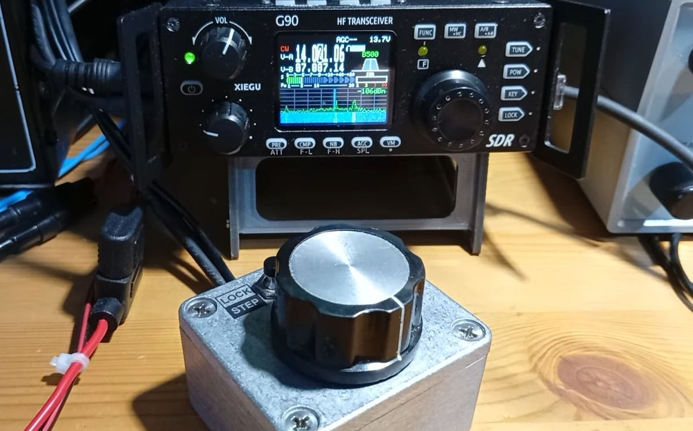
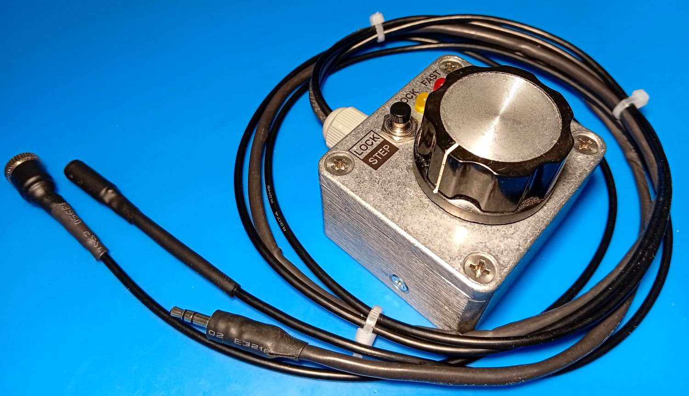
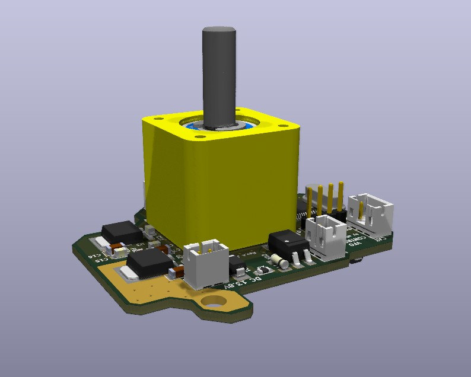

# CAT VFO Controller for Xiegu G90 (STM32 + MT6701)

 

---

<b>Читать на русском языке 🇷🇺</b>

Выносной магнитный валкодер (пульт управления) для КВ-трансивера **Xiegu G90**. 

Проект разработан на базе неблокирующих конечных автоматов (FSM) для воссоздания классического «аналогового» и тактильно приятного ощущения плавной настройки, которого так не хватает штатным энкодерам.

Официальная страница проекта: [https://xflyingcat.ru/catvfoctrl.html](https://xflyingcat.ru/catvfoctrl.html)

### 🚀 Технические особенности реализации (по коду)

* **Психофизический тайминг (50 мс):** Опрос дельты энкодера происходит с оптимизированным квантом времени **50 мс**. Пакет частоты отправляется в трансивер только при наличии реального смещения вала. Это обеспечивает плавность настройки без задержек и исключает перегрузку шины CAT.
* **Магнитный энкодер (MT6701):** Высокоточный бесконтактный датчик, настроенный на фиксированные **400 импульсов на оборот**. При шаге 10 Гц это дает **4 кГц на оборот**.
* **Аппаратный уровень (STM32F103):** 
    * Квадратурный сигнал энкодера обрабатывается аппаратным таймером `TIM1` в 16-битном режиме.
    * Отправка САТ-команд в трансивер автоматизирована через **DMA** (`DMA1_Channel4`), что освобождает процессор от ожидания отправки байт.
    * Входящий САТ-поток принимается по прерываниям во встроенный кольцевой **FIFO-буфер емкостью 128 байт** с обеспечением атомарности операций при чтении.
* **Аппаратная фильтрация эха:** На однопроводной шине CI-V контроллер автоматически отфильтровывает собственное эхо отправленных пакетов, реагируя только на входящие сообщения, адресованные мастеру (`THIS_MACHINE_ADDRESS = 0xE0`).
* **Двусторонняя синхронизация (Таймаут 500 мс):** Если ручка пульта статична более 500 мс, контроллер запрашивает текущую частоту у Xiegu G90 (команда `0x25 0x00`). Это предотвращает «скачки» частоты при ручной перестройке на самом трансивере или смене диапазона.
* **Управление шагом (10 Гц / 1 Гц):** Переключение шага реализовано на удержание кнопки LOCK. При возврате с точности 1 Гц на шаг 10 Гц алгоритм автоматически выполняет математическое округление частоты до десятков (`(freq / 10) * 10`), убирая дробный «хвост».
* **Промышленная безопасность PTT (Anti-Stick Watchdog):** Встроенный программный интегратор кнопок с антидребезгом (100 мс). Для линии PTT реализован таймер безопасности: при непрерывном удержании передачи более **2 минут**, контроллер принудительно отключает PTT по CAT для защиты выходного каскада трансивера от перегрева.

### 🛠 Аппаратная часть (Hardware)

* **Микроконтроллер:** STM32F103C8T6.
* **Защита цепей:** Гальваническая опторазвязка линии PTT для исключения земляных петель и TVS-супрессоры на линиях RxD/TxD CAT-интерфейса.
* **Механика:** Вал на двух подшипниках с преднатягом.
* **Корпус:** Литой алюминиевый экранированный корпус **Gainta G104** с резиновыми ножками для устойчивости.
* **Кабель:** 

 

Единый пучок длиной 0.5 м (Питание DC, CAT Jack 3.5мм(штеккер), PTT Jack 3.5мм(гнездо)), введенный через гермоввод.
* **PCB** Проект будущей печатной платы представлен в формате **KiCad**. Плата совсем недавно заказана. 

 

### 💻 Программное обеспечение процесса разработки (Software)

* **Среда разработки:** XPack arm-none-eabi gcc, XPack windows build tools.
* **EDA:** **KiCad**.
---

<b>Read in English 🇬🇧</b>

External VFO controller with magnetic encoder for the **Xiegu G90** HF transceiver based on non-blocking Finite State Machines (FSM).

This project was designed to recreate the classic, tactilely pleasant "analog" feel of smooth tuning, which stock detent encoders lack.

Project Homepage: [https://xflyingcat.ru/catvfoctrl.html](https://xflyingcat.ru/catvfoctrl.html)

### 🚀 Code Architecture

* **Psychophysical Timing (50 ms):** Encoder delta polling occurs with an optimized **50 ms** time quantum. A CAT packet is transmitted only when a physical shaft displacement is detected. This provides absolute tuning smoothness with zero lag and prevents transceiver CAT bus overloading.
* **Magnetic Encoder (MT6701):** High-precision contactless 14-bit sensor configured for a fixed **400 pulses per revolution**. With a 10 Hz tuning step, this delivers **4 kHz per revolution**.
* **Hardware Level (STM32F103):** 
    * Quadrature encoder signals decoded via hardware `TIM1` timer peripheral in 16-bit mode.
    * Outgoing CAT commands handled smoothly using hardware **DMA** (`DMA1_Channel4`), bypassing CPU wait cycles.
    * Incoming CAT stream parsed via an interrupt-driven ring **FIFO buffer (128 bytes)** with atomic read operation locks.
* **Hardware Echo Filtering:** On the single-wire CI-V bus, the controller automatically filters out its own transmitted echo packets by validating the destination address (`THIS_MACHINE_ADDRESS = 0xE0`).
* **Bidirectional Sync (500 ms Timeout):** If the VFO knob is idle for >500 ms, the controller automatically polls the Xiegu G90 for its current frequency (using advanced `0x25 0x00` command). This prevents frequency "jumps" if you change bands directly on the radio.
* **Step Control (10 Hz / 1 Hz):** Step size switching is bound to a long press of the LOCK button. When returning to 10 Hz, the frequency is automatically rounded to the nearest tens of Hz (`(freq / 10) * 10`) to clean up fractional offsets.
* **Industrial Grade PTT Safety (Anti-Stick Watchdog):** Advanced integration-based debounce algorithm (100 ms). The PTT line features a built-in safety watchdog: if the PTT remains engaged for more than **2 minutes**, the transmission is forcefully aborted via CAT to protect the radio's PA stage from overheating.

### 🛠 Hardware Specifications

* **MCU:** STM32F103C8T6 (Custom PCB is under development).
* **Circuit Protection:** Optocoupler galvanic isolation for the PTT line to break ground loops; low-capacitance TVS suppressor arrays on the CAT RxD/TxD lines.
* **Mechanics:** Custom shaft assembly utilizing dual preloaded ball bearings.
* **Enclosure:** Die-cast aluminum shielded **Gainta G104** housing.
* **Cable Assembly:** 

 

Integrated 0.5-meter harness (DC Power, CAT 3.5mm Jack/Plug, PTT 3.5mm Jack/Socket) routed via a cable gland.

* **PCB** is presented in **KiCad** format. PCB manufacturing just ordered.

 

### 💻 Software Stack

* **IDE:** XPack arm-none-eabi gcc, XPack windows build tools.
* **EDA:** **KiCad**.

