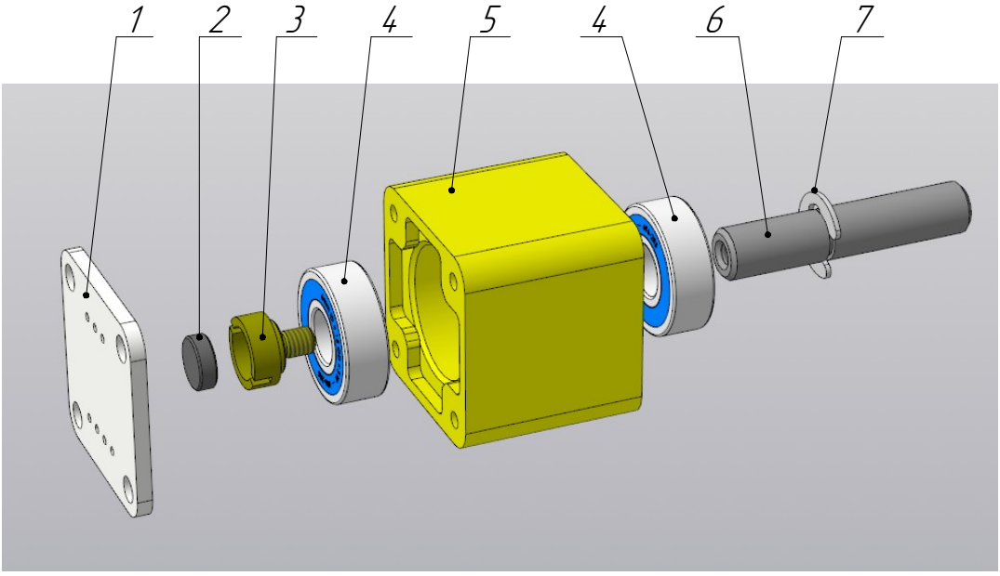
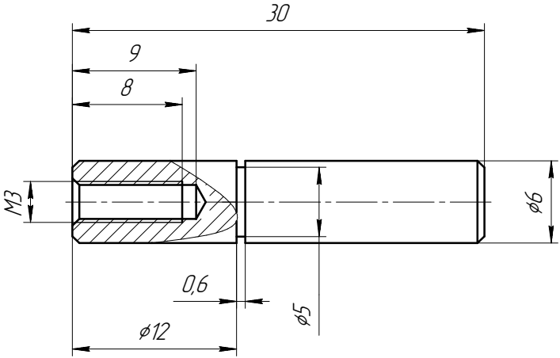
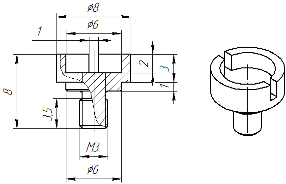

# Encoder Mechanical Design & Assembly Guide

This document describes the mechanical construction of the precision, zero-backlash rotary encoder mechanical assembly designed for the VFO controller. It provides a robust, heavy, and smooth "analog-like" feel suitable for radio transceiver tuning nodes.

---

## 1. Specifications & Bill of Materials (BOM)

The assembly consists of a 3D-printed housing, two deep-groove ball bearings, a machined steel shaft, and a magnetic sensor coupling.

| Item | Description | Material / Specification | Qty |
| :--- | :--- | :--- | :---: |
| **1** | Sensor PCB | MT6701 (or AS5600) break-out board | 1 pc. |
| **2** | Permanent Magnet | Diametrically magnetized, Ø6x2 mm | 1 pc. |
| **3** | Custom Shaped Screw | C3604 (ЛС59) Free-cutting Brass | 1 pc. |
| **4** | Deep Groove Ball Bearing | 6x15x5 mm (696zz) | 2 pcs. |
| **5** | Main Housing | 3D-Printed Plastic (PLA/PETG) | 1 pc. |
| **6** | Encoder Shaft | AISI 1045 (Сталь 45) Calibrated Rod, Ø6 mm | 1 pc. |
| **7** | Retaining Ring | Quick-release E-clip for Ø6 mm shaft | 1 pc. |

---

## 2. Component Drawings & Manufacturing Details

Three custom components need to be fabricated or 3D-printed to complete the assembly:

### Encoder Shaft (Item 6)
Machined from a calibrated **AISI 1045 carbon steel** (Сталь 45) round bar. It features an internal M3 thread for the brass screw and a precise retaining ring groove to lock axial play.

### Custom Shaped Brass Screw (Item 3)
Turned from an **C3604 brass** (ЛС59) rod. Brass is selected because it is non-magnetic and will not distort or shield the magnetic field lines directed toward the sensor chip. It includes a dedicated front pocket (lodgement) for the Ø6x2 mm magnet.

### Housing (Item 5)
The main body is manufactured using additive manufacturing (3D printing). The STL file (`encoder_body.stl`) is available in the repository. 

---

## 3. Step-by-Step Assembly Instructions

To ensure a smooth, backlash-free operation with proper bearing preload, assemble the unit exactly as follows:

1. **Magnet Bonding:**
   * Clean the front pocket of the brass screw (**Item 3**).
   * Glue the diametrically magnetized magnet (**Item 2**) into the pocket using a drop of high-strength cyanoacrylate (super glue) or epoxy. Let it cure completely.

2. **Bearing Installation:**
   * Press-fit the two ball bearings (**Item 4**) into the front and rear recesses of the 3D-printed housing (**Item 5**).
   * *Tip:* For perfect alignment, use a drill press quill acting through a flat mandrel to slide them in square. Avoid heavy hammer impacts that can misalign the outer and inner races.

3. **Shaft Assembly & Preload Adjustment:**
   * Slide the steel shaft (**Item 6**) into the housing through the inner rings of both bearings from the front side.
   * Snap the E-clip retaining ring (**Item 7**) into its groove on the shaft to secure it against the front bearing.
   * Insert and tighten the custom brass screw (**Item 3**) into the rear end of the shaft. Use a custom-made fork/pin wrench plate that fits snugly into the screw slots.
   * Tighten the screw until you achieve the desired **bearing preload**. You should feel a slight, stable "viscosity" during rotation and absolutely zero axial (longitudinal) play. 
   * Once adjusted, back the screw out slightly, apply a drop of threadlocker, and tighten it back down to seal the preload.

4. **Sensor PCB Mounting:**
   * Attach the MT6701 sensor PCB (**Item 1**) to the back face of the housing.
   * Secure it using small pan-head self-tapping screws (ST2.5 x 6 mm). Ensure the sensor IC is perfectly aligned and centered relative to the axis of the rotating magnet.

   ---

> 📌 **Note on Sensor PCB (Item 1):**  
> The breakout board shown as **Item 1** in the exploded view drawing is a generic AliExpress MT6701/AS5600 module and is used **strictly as a mechanical reference** for dimensions and mounting holes.  
> For this project, you should use the custom **`catvfoctrl`** PCB provided in this repository. It perfectly matches the mounting holes of this mechanical assembly but completely eliminates the need for manual hardware modifications (like cutting traces), as the STM32 MCU automatically configures the sensor over I2C at startup.

